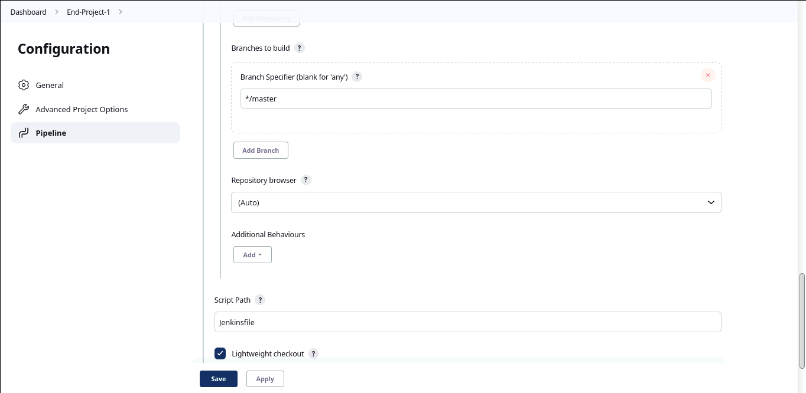

1. Link github repo: https://github.com/lam-phanminh/End-Project-1 
    
    - In this repo, I add Dockerfile to build source code PHP.
    - About Dockerfile: 

     

   - Base image: ```devopsedu/webapp```
   - My workdir is ``/var/www/html``
   - I add line `` DirectoryIndex  index.php `` into ``000-default.conf`` file and copy ``000-default.conf`` from this directory to `` /etc/apache2/sites-enabled/ `` of container.
   - Copy source code to `` /var/www/html `` 
   - Expose port 80 
   - Final, start apache. 
  
2. Create Jenkins pipeline job and config: 
   
     
     

    - Job: 

    

3. Jenkinsfile: 

   

4. Ansible:
   -  ``Playbook``: 
  
    

   - ``Inventory``: 
  
    

5. Console output: 
   - Stage ``Checkout...``:
  
    

   - Stage ``Build......``: 
  
    
    

   - Stage ``Docker login && push image ......`` 

    
    

   - Stage `` Deploy... `` 
  
    
    

   - ``Log ansible:`` 
  
    

6. ``Image pushed to dockerhub:``
   
   

7. ``Container run:``
   
    

8. ``Web built:`` 

   

****